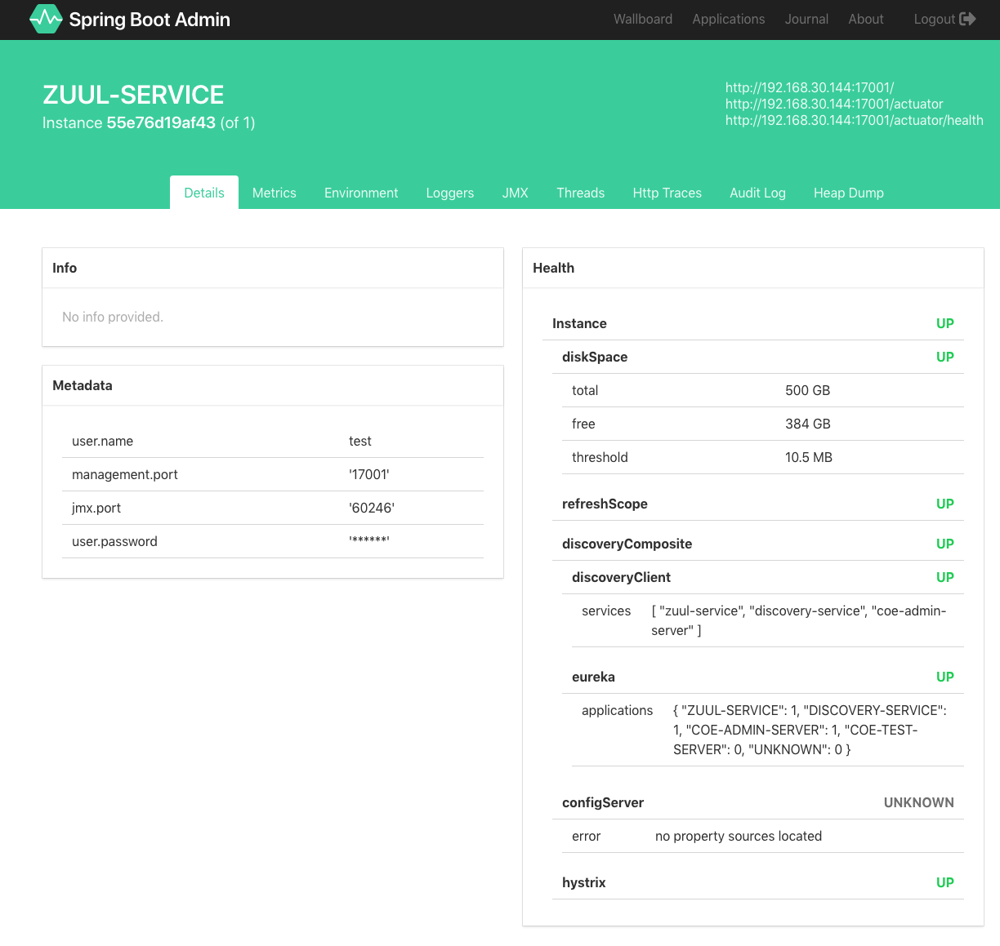

# Spring Boot Admin 예제

Spring Boot Admin Server 예제 코드

## 시스템 요구사항

| Type      	| Tool         	| Version      	|
|-----------	|--------------	|--------------	|
| Compiler  	| Java         	| 1.8 이상     	|
| Builder   	| maven        	| 3.2 이상     	|
| Framework 	| Spring Boot  	| 2.0.1        	|
|           	| Spring Cloud 	| Finchley.RC2 	|

## Dashboard UI 예제
